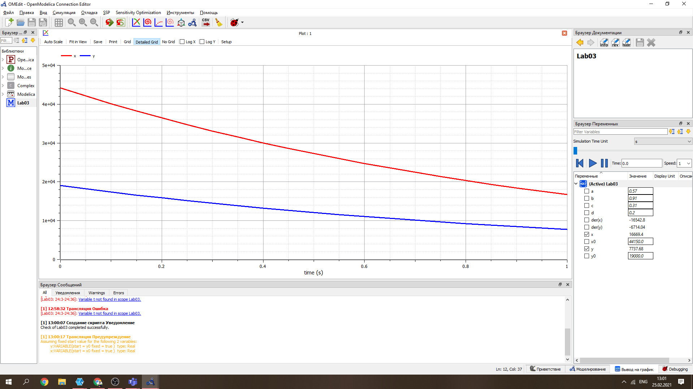
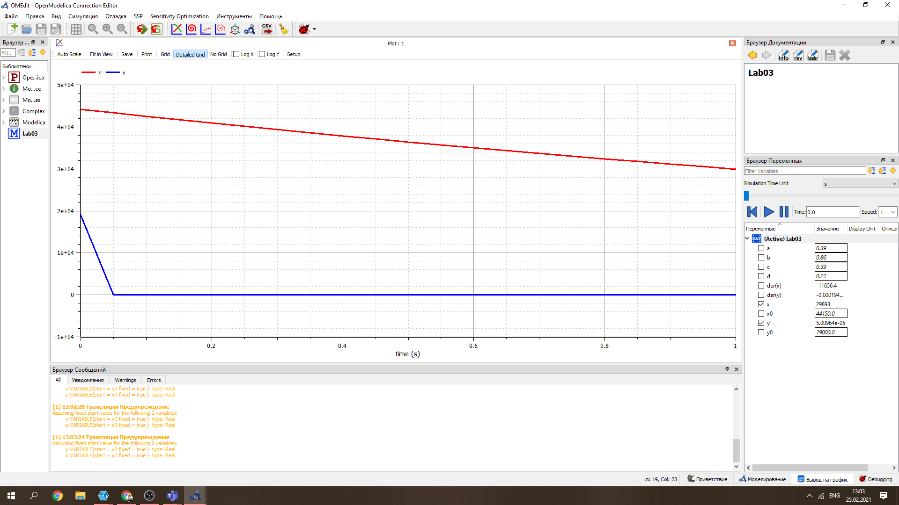

---
# Front matter
lang: ru-RU
title: "Лабораторная работа по математическому моделированию номер 3."
author: "Подмогильный Иван Александрович"

# Formatting
toc-title: "Содержание"
toc: true # Table of contents
toc_depth: 2
lof: false # List of figures
lot: false # List of tables
fontsize: 12pt
linestretch: 1.5
papersize: a4paper
documentclass: scrreprt
polyglossia-lang: russian
polyglossia-otherlangs: english
mainfont: PT Serif
romanfont: PT Serif
sansfont: PT Sans
monofont: PT Mono
mainfontoptions: Ligatures=TeX
romanfontoptions: Ligatures=TeX
sansfontoptions: Ligatures=TeX,Scale=MatchLowercase
monofontoptions: Scale=MatchLowercase
indent: true
pdf-engine: lualatex
header-includes:
  - \linepenalty=10 # the penalty added to the badness of each line within a paragraph (no associated penalty node) Increasing the value makes tex try to have fewer lines in the paragraph.
  - \interlinepenalty=0 # value of the penalty (node) added after each line of a paragraph.
  - \hyphenpenalty=50 # the penalty for line breaking at an automatically inserted hyphen
  - \exhyphenpenalty=50 # the penalty for line breaking at an explicit hyphen
  - \binoppenalty=700 # the penalty for breaking a line at a binary operator
  - \relpenalty=500 # the penalty for breaking a line at a relation
  - \clubpenalty=150 # extra penalty for breaking after first line of a paragraph
  - \widowpenalty=150 # extra penalty for breaking before last line of a paragraph
  - \displaywidowpenalty=50 # extra penalty for breaking before last line before a display math
  - \brokenpenalty=100 # extra penalty for page breaking after a hyphenated line
  - \predisplaypenalty=10000 # penalty for breaking before a display
  - \postdisplaypenalty=0 # penalty for breaking after a display
  - \floatingpenalty = 20000 # penalty for splitting an insertion (can only be split footnote in standard LaTeX)
  - \raggedbottom # or \flushbottom
  - \usepackage{float} # keep figures where there are in the text
  - \floatplacement{figure}{H} # keep figures where there are in the text
---

# Цель работы

Ознакомиться с простейшими моделями боевых действий - модели Ланчестера.

# Задание

Было необходимо:
Построить графики изменения численности войск армии X и армии Y для случаев:
\begin{itemize}
  \item  Модель боевых действий между регулярными войсками
  \item  Модель ведения боевых действий с участием регулярных войск и партизанских отрядов.
\end{itemize}

# Выполнение лабораторной работы
Рассматриваю первый случай, с регулярными войсками:
\begin{itemize}
\item скорость уменьшения численности войск из-за причин, не связанных с
боевыми действиями (болезни, травмы, дезертирство);
\item скорость потерь, обусловленных боевыми действиями
противоборствующих сторон (что связанно с качеством стратегии,
уровнем вооружения, профессионализмом солдат и т.п.);
\item скорость поступления подкрепления (задаётся некоторой функцией от
времени).
\end{itemize}

Следовательно модель боевых дейсвтий между войсками описывается следующим образом:
$$dx/dt = -a(t)x(t) -b(t)y(t) + P(t)$$
$$dy/dt = -c(t)x(t) -h(t)y(t) + Q(t)$$
(Система 1)

Потери, не связанные с боевыми действиями, описывают члены $-a(t)x(t)$ и
$-h(t)y(t)$, члены $-b(t)y(t)$ и $-c(t)x(t)$ отражают потери на поле боя.
Коэффициенты $b(t)$ и $c(t)$ указывают на эффективность боевых действий со стороны у и х соответственно,
$a(t),h(t)$ - величины, характеризующие степень
влияния различных факторов на потери. Функции P(t), Q(t), учитывают 
возможность подхода подкрепления к войскам Х и У в течение одного дня.

График модели:

{ #fig:001 width=70% }

Во втором случае в борьбу добавляются партизанские отряды. Нерегулярные
войска в отличии от постоянной армии менее уязвимы, так как действуют скрытно,
в этом случае сопернику приходится действовать неизбирательно, по площадям,
занимаемым партизанами. Поэтому считается, что тем потерь партизан,
проводящих свои операции в разных местах на некоторой известной территории,
пропорционален не только численности армейских соединений, но и численности
самих партизан. В результате модель принимает вид:

$$dx/dt = -a(t)x(t) -b(t)y(t) + P(t)$$
$$dy/dt = -c(t)x(t)y(t) -h(t)y(t) + Q(t)$$
(Система 2)

В этой системе все величины имею тот же смысл, что и в системе (1).

График модели:

{ #fig:001 width=70% }

# Выводы
Ознакомился с простейшей моделью боевых действий - моделью Ланчестера. Научился строить эту модель
в программе Modelica. 